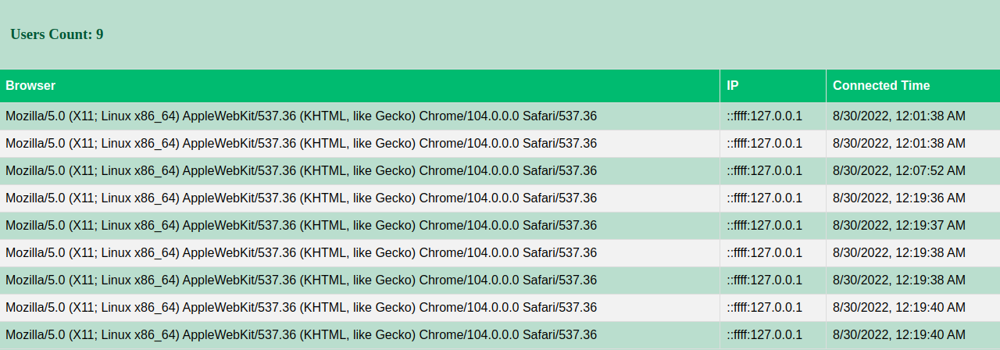

# Socket.Io 

## Get Real time users count

## Local Setup

The first time you need to install npm
```
npm install
```
Then set up config.js
```
module.exports = {
    siteUrl: 'http://www.example.com',
    port: 8082,
    dbConfig: {
        host: 'localhost',
        user: 'developer',
        password: 'Dev_123456',
        database: 'rosary'
    }
}
```
Then set up apache server,
ports should be like on config.js,
for example 8082

```
<VirtualHost *:80>
   ServerAdmin admin@propulsion360.site
   ServerName example.site
   ServerAlias www.example.site
   DocumentRoot /var/www/apache_socket_io
  
   RewriteEngine On
   RewriteCond %{REQUEST_URI}  ^/socket.io            [NC]
   RewriteCond %{QUERY_STRING} transport=websocket    [NC]
   RewriteRule /(.*)           ws://localhost:8082/$1 [P,L]

   ProxyPass        /socket.io http://localhost:8082/socket.io
   ProxyPassReverse /socket.io http://localhost:8082/socket.io

        <Directory "/var/www/apache_socket_io">
            AllowOverride all
        </Directory>
</VirtualHost>
```
And lastly, you need to start the node server
```
node index.js
```